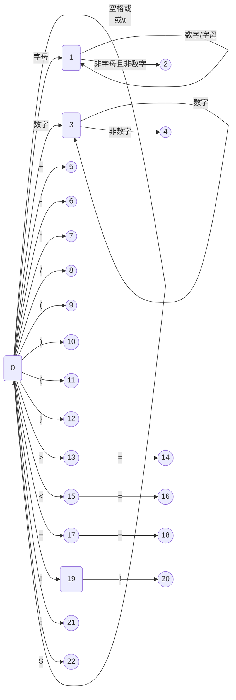

# C_Compiler_Project

## 简介

编译原理课程设计 - 文法设计 & 词法分析 & LL(1)语法分析 & 语义分析(语法制导翻译)

## 文法设计Grammar

### 终结符

`main` `int` `if` `else` `return` `+` `-` `*` `/` `=` `equal` `less_than` `less_euqal` `great_than` `great_equal` `not_equal` `(` `)` `{` `}` `id` `digit` `;` `$`

### 非终结符

`<程序>` `<main函数>` `<返回类型>` `<变量类型>` `<复合语句>` `<语句序列>` `<语句>` `<语句递归>` `<定义语句>` `<赋初值>` `<赋值语句>` `<条件语句>` `<布尔表达式>` `<表达式>` `<项>` `<项递归>` `<因式>` `<因式递归>` `<关系运算符>` `<标识符>` `<无正负号常量>`

### 文法产生式

|     非终结符命名     |                                         产生式                                         |
| :------------------: | :------------------------------------------------------------------------------------: |
|       program        |                                <程序> ::= <main函数> $                                 |
|       main_fun       |                     <main函数> ::= <返回类型> main ( ) <复合语句>                      |
|     return_type      |                               <返回类型> ::= <变量类型>                                |
|       var_type       |                                   <变量类型> ::= int                                   |
|   struct_statement   |                             <复合语句> ::= { <语句序列> }                              |
|   statements_list    |                         <语句序列> ::= <语句> <语句递归> \| ε                          |
|      statement       |  <语句> ::= <定义语句> \| <赋值语句> \| <条件语句> \| <复合语句> \| return <表达式> ;  |
| statements_recursive |                         <语句递归> ::= <语句> <语句递归> \| ε                          |
|   define_statement   |                     <定义语句> ::= <变量类型> <标识符> <赋初值> ;                      |
|    assign_default    |                              <赋初值> ::= = <表达式> \| ε                              |
|   assign_statement   |                          <赋值语句> ::= <标识符> = <表达式>;                           |
| condition_statement  |             <条件语句> ::= if ( <布尔表达式> ) <复合语句> else <复合语句>              |
|   bool_expression    |                    <布尔表达式> ::= <表达式> <关系运算符> <表达式>                     |
|      expression      |                               <表达式> ::= <项> <项递归>                               |
|         item         |                               <项> ::= <因式> <因式递归>                               |
|   items_recursive    |                  <项递归> ::= + <项> <项递归> \| - <项> <项递归> \| ε                  |
|   factor_recursive   |             <因式递归> ::= * <因式> <因式递归> \| / <因式> <因式递归> \| ε             |
|        factor        |                 <因式> ::= <标识符> \| <无正负号常量> \| ( <表达式> )                  |
|  relation_operator   | <关系运算符> ::= equal \| less \| less_equal \| great_than \| great_equal \| not_equal |
|     _identifier      |                                    <标识符> ::= id                                     |
|    unsigned_const    |                                <无正负号常量> ::= digit                                |

**注意:**

文法中以显式 `$` 作为结束符号.

## 词法分析LexAnalyse

词法分析依据以下的DFA进行分析:

## 语法分析SynAnalyse

### First集

|    非终结符    | First集合列表 |           |            |            |             |           |
| :------------: | :-----------: | :-------: | :--------: | :--------: | :---------: | :-------: |
|     <程序>     |      int      |
|   <main函数>   |      int      |
|   <返回类型>   |      int      |
|   <变量类型>   |      int      |
|   <复合语句>   |       {       |
|   <语句序列>   |      int      |    id     |     if     |     {      |   return    |     ε     |
|     <语句>     |      int      |    id     |     if     |     {      |   return    |
|   <语句递归>   |      int      |    id     |     if     |     {      |   return    |     ε     |
|   <定义语句>   |      int      |
|    <赋初值>    |       =       |     ε     |
|   <赋值语句>   |      id       |
|   <条件语句>   |      if       |
|  <布尔表达式>  |      id       |   digit   |     (      |
|    <表达式>    |      id       |   digit   |     (      |
|    <项递归>    |       +       |     -     |     ε      |
|      <项>      |      id       |   digit   |     (      |
|   <因式递归>   |       *       |     /     |     ε      |
|     <因式>     |      id       |   digit   |     (      |
|  <关系运算符>  |     equal     | less_than | less_equal | great_than | great_equal | not_equal |
|    <标识符>    |      id       |
| <无正负号常量> |     digit     |

### Follow集

|    非终结符    | First集合列表 |       |           |            |            |             |            |             |            |             |             |           |       |
| :------------: | :-----------: | :---: | :-------: | :--------: | :--------: | :---------: | :--------: | :---------: | :--------: | :---------: | :---------: | :-------: | :---: |
|     <程序>     |
|   <main函数>   |       $       |
|   <返回类型>   |     main      |
|   <变量类型>   |     main      |  id   |
|   <复合语句>   |       $       |
|   <语句序列>   |       }       |
|     <语句>     |      int      |  id   |    if     |     {      |   return   |      }      |
|   <语句递归>   |       }       |
|   <定义语句>   |      int      |  id   |    if     |     {      |   return   |      }      |
|    <赋初值>    |       ;       |
|   <赋值语句>   |      int      |  id   |    if     |     {      |   return   |      }      |
|   <条件语句>   |      int      |  id   |    if     |     {      |   return   |      }      |
|  <布尔表达式>  |       )       |
|    <表达式>    |       ;       | equal | less_than | less_equal | great_than | great_equal | not_equal  |      )      |
|    <项递归>    |       ;       | equal | less_than | less_equal | great_than | great_equal | not_equal  |      )      |
|      <项>      |       +       |   -   |     ;     |   equal    | less_than  | less_equal  | great_than | great_equal | not_equal  |      )      |
|   <因式递归>   |       +       |   -   |     ;     |   equal    | less_than  | less_equal  | great_than | great_equal | not_equal  |      )      |
|     <因式>     |       *       |   /   |     +     |     -      |     ;      |    equal    | less_than  | less_equal  | great_than | great_equal |  not_equal  |     )     |
|  <关系运算符>  |      id       | digit |     (     |            |            |             |
|    <标识符>    |       =       |   *   |     /     |     +      |     -      |      ;      |   equal    |  less_than  | less_equal | great_than  | great_equal | not_equal |   )   |
| <无正负号常量> |       *       |   /   |     +     |     -      |     ;      |    equal    | less_than  | less_equal  | great_than | great_equal |  not_equal  |     )     |

### LL(1)分析表

略(可知本文法无冲突)

### 小结

受水平所限, First集与Follow集手动生成, 然后根据递归子程序生成语法分析程序.

若水平足够, 可考虑由程序生成First集与Follow集, 继而生成LL(1)分析表. 根据符号栈和单词栈进行语法分析.

一般来说, 在发现语法错误时无法继续进行下去. 换句话说, 只能识别一个语法错误. 本代码中加入了一些可能产生的语法错误预测, 在不影响后续处理的前提下尽可能发现更多的语法错误, 提高效率.

## 语义分析(语法制导翻译)

在语法分析的递归子程序基础上插入一系列动作, 由表达式转化成四元式中间代码(不采用三元式有一定考量, 对于 `if...else...` 语句块的跳转语句不明确).

### 四元式表现形式

`(<语句号>) <动作> <第1个输入> <第二个输入> <输出>`

**注意:**

1. 若某一单元格内无内容则使用下划线 `_` 表示;

2. 临时变量用 `Ti` 表示, 如第0个产生的临时变量记为 `T0` (代码中有临时变量回收机制).

示例如下(语句号为随机, 仅供示例):

- 定义语句: `(1) assign int _ i` 表示标识符 `i` 定义为 `int` 类型

- 逻辑运算: `(2) + i + 1 T0` 表示 `T0 = i + 1`

- 赋值语句: `(3) = 1 _ i` 表示 `i = 1`

- 条件判断: `(4) < i j T0` 表示 `T0 = i < j`

- 非真跳转: `jne` 意为 `jump not equal true`, `(5) jne T0 _ (6)` 表示当T0为假时跳转到第6条语句
